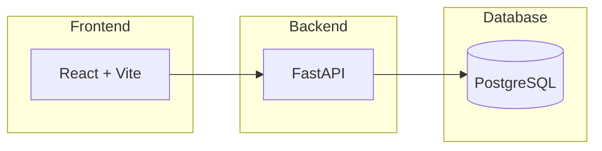
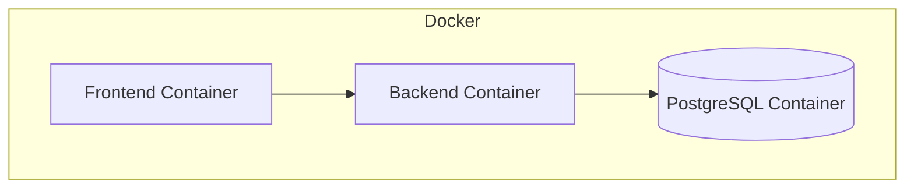
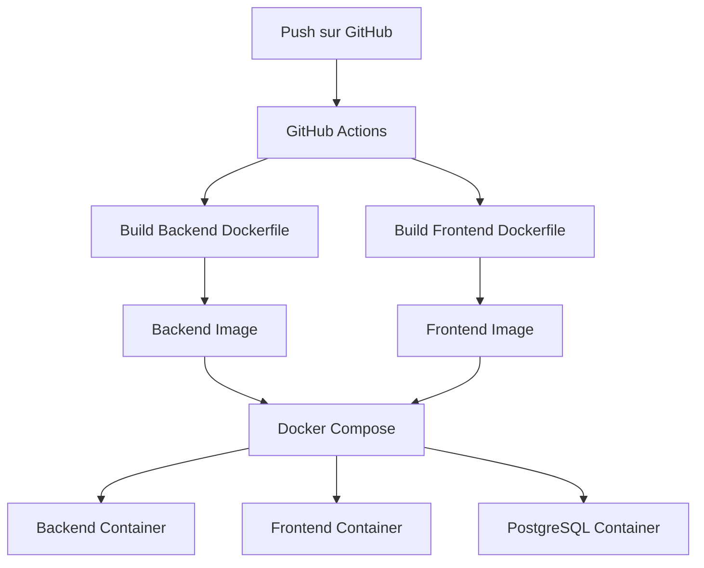

## Architecture globale du projet

## 2. Architecture Docker

## Pipeline CI/CD GitHub Actions

## 7. Structure du dépôt
h4ckr-devops/
│
├── backend/
│   ├── Dockerfile
│   ├── main.py
│   ├── requirements.txt
│   └── ...
│
├── frontend/
│   ├── Dockerfile
│   ├── package.json
│   ├── src/
│   └── ...
│
├── docker-compose.yml
│
├── .github/
│   └── workflows/
│       └── ci-cd.yml
│
├── screenshots/
│
└── README.md

## Objectif DevOps
Ce dépôt a pour but de :

Centraliser l’architecture complète du projet

Montrer une pipeline CI/CD fonctionnelle

Illustrer une stack full DevOps

Monter en compétences

## À propos de l’auteure

Jenet  

Étudiante Bac+2 Informatique – Réseaux & Cybersécurité
Préparation Bac+3 en alternance (Administrateur LAN / DevOps)
Passionnée par :

les architectures réseau

la cybersécurité

le DevOps

les pipelines CI/CD

Docker & FastAPI

les projets techniques concrets